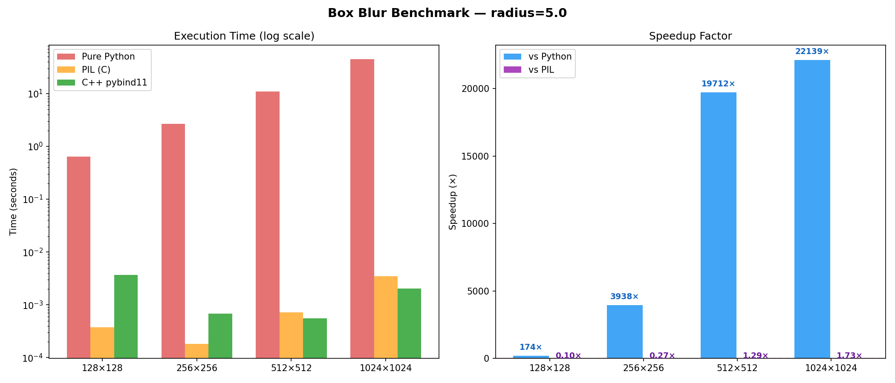

# fast_blur — High-Performance Box Blur via pybind11 + OpenMP

A Python-callable C++ image blur extension that **outperforms PIL** at large image sizes,
using a separable three-zone fixed-point algorithm with OpenMP multi-core parallelism.

## Benchmark (radius=5, MacBook Air M-series)

| Image Size | Pure Python | PIL (C) | **C++ pybind11** | vs Python | vs PIL |
|------------|-------------|---------|------------------|-----------|--------|
| 512×512    |   11.04s    |  0.0007s|    0.0006s       |  18552.6× |  1.20× |
| 1024x1024  |   45.250s   |  0.0057s|    0.0040s       |  11401.7x |  1.43x |
|2048x2048   |   181.882s  |  0.0205s|    0.0108s       |  16862.2x |  1.90x |
|4096x4096   |   728.673s  |  0.1924s|    0.0661s       |  11027.4x |  2.91x |

> Measured with `python3 benchmarks/bench.py --image photo.jpg --radius 5.0`



## How it works
Python call → pybind11 binding → C++ separable blur

├── Horizontal pass (H rows, OpenMP parallel)

│     Zone 1: growing window  → integer divide

│     Zone 2: full window     → fixed-point multiply (no divide)

│     Zone 3: shrinking window → integer divide

└── Vertical pass  (same three-zone trick)

Key techniques:
- **Separable passes** — O(r) per pixel instead of O(r²), regardless of radius
- **Fixed-point multiply** instead of integer divide in the hot path
- **uint8 temp buffer** — stays in L1/L2 cache vs float32 alternatives
- **OpenMP** — parallel rows/columns above 200×200 threshold
- **GIL release** — `py::gil_scoped_release` allows true multi-threading

## Usage

```python
import numpy as np
from fast_blur import blur

img = np.array(Image.open("photo.jpg").convert("RGB"))
blurred = blur(img, radius=5.0)   # float radius, just like PIL.ImageFilter.BoxBlur
```

## Install & Build

```bash
# Prerequisites (macOS)
brew install cmake libomp
pip install pybind11 numpy pillow scikit-build-core

# Build
cmake -B build -DCMAKE_BUILD_TYPE=Release
cmake --build build

# Editable install
pip install -e .

# Run tests
pytest tests/ -v

# Run benchmark
python3 benchmarks/bench.py --image photo.jpg --radius 5.0
```

## Project structure
fast_blur/

├── src/blur.cpp          # C++ core (three-zone separable algorithm)

├── python_impl/blur.py   # Pure Python baseline (for comparison)

├── tests/test_blur.py    # pytest: correctness + edge cases

├── benchmarks/bench.py   # Python vs PIL vs C++ benchmark + chart

├── CMakeLists.txt

└── pyproject.toml
